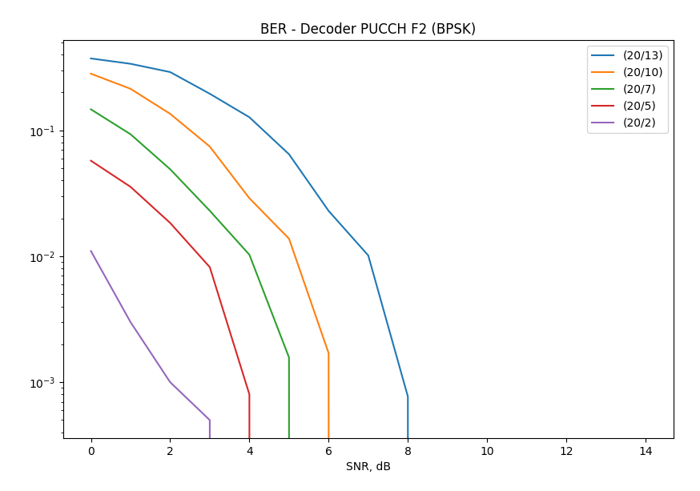

# Decode_PUCCH

Дополнительные задания
- Замерьте время работы блок-декодера. Попробуйте максимально уменьшить время
используя различные приемы.

    - тут бы надо уточнить. Ускорить выполнение алгоритма грубой силы или применить другой алгоритм?

Я использовал примитивный метод параллелизации OMP.

(20/13)

- Попробуйте качественно объяснить ход отснятых вами кривых. Почему код (20, 2)
гораздо более помехоусточив чем (20, 11) 
    - Это зависит от избыточности либо у нас 2 полезных бита и 18 избыточных, либо 11 полезных и 9 избыточных. Чем больше избыточных бит тем более помехоустойчив код.

